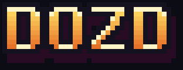

# DOZD



A co-op space-pirate heist game. Loot a station three decks deep, ride the lift
down to richer decks, and get out on a hazard pad before security overwhelms
you. Only the pirates standing on the pad when it finishes get out.

Built with Rust and [Bevy](https://bevyengine.org/); LAN multiplayer uses
[bevy_replicon](https://github.com/projectharmonia/bevy_replicon).

## Run

```sh
cargo run --release                    # main menu
cargo run --release -- solo            # straight into a solo run
cargo run --release -- host [port]     # host a LAN game (default port 5000)
cargo run --release -- join <address>  # join a host, e.g. 192.168.1.20 or host:5000
```

Release builds embed all assets, so `target/release/dozd` is a single file you
can hand to friends.

## Pirates

Pick a class and your guns under **LOADOUT** in the main menu before a raid.
Every pirate carries 3 guns, in the order you pick them.

| Class | Ability |
| --- | --- |
| Gunner | Carries a 4th gun |
| Engineer | Q drops a sentry gun that shoots guards for 15 s (25 s cooldown). Guards shoot back at it |
| Bulwark | Q raises or lowers a riot shield you carry in front of you, turning as you aim. No shot gets through, from either side, and you can't fire while holding it. It drains while up (10 s from full) and recharges while down (22 s from empty) |
| Hacker | Q turns the guard nearest your crosshair to the crew's side for 20 s (30 s cooldown) |

## Controls

| Key | Action |
| --- | --- |
| WASD / arrows | Move |
| Mouse | Aim |
| Left click | Fire |
| Space | Dash |
| R | Reload |
| 1-4 / wheel | Switch gun |
| Q | Class ability |
| E | Take loot |
| Enter | Play again (results screen) |
| Esc | Leave / back |

## Headless

Runs the game with no window, rendering or input, many times faster than real
time. Bots play the pirates, and every run is reproducible from its seed.

```sh
cargo run --release -- headless --seed 1 --runs 20
```

Options: `--seed N`, `--runs N`, `--crew 1-8`,
`--class gunner|engineer|bulwark|hacker|mixed` (bots' class; mixed rotates), `--bot random|idle`,
`--time SECS` (per-run limit), `--hz N` (steps per game second).

## Development

```sh
cargo test
cargo clippy
python3 tools/gen_assets.py   # regenerate the pixel-art sprites in assets/
```

Game rules live in each module's main plugin (`GamePlugins`); sprites, HUD,
menus and input live in its `*ViewPlugin` (`ViewPlugins`), which headless mode
leaves out.
